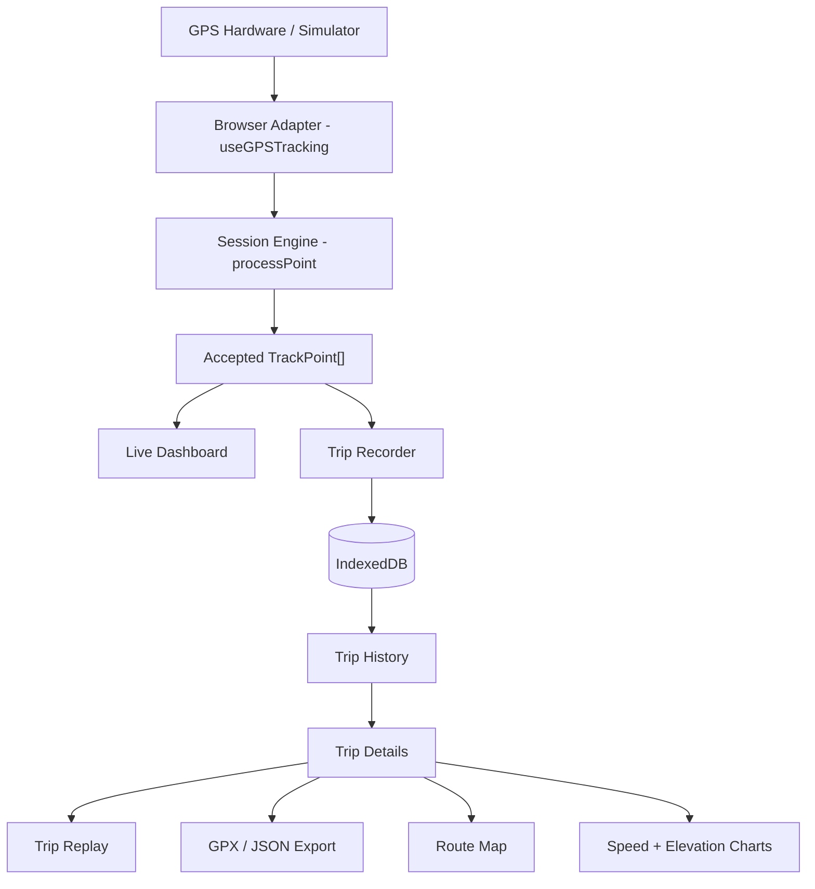

# GPS Speed Tracker V2 — Implementation Plan

## Architecture Overview



### Current Codebase Inventory

| File | Role | Changes Needed |
|------|------|----------------|
| [types/gps.ts](file:///Users/akhilpt/Downloads/gps/src/types/gps.ts) | Core GPS types | Add `Trip`, `TripMeta` types |
| [utils/session.ts](file:///Users/akhilpt/Downloads/gps/src/utils/session.ts) | Pure processing engine | Add elevation stats helper |
| [hooks/useGPSTracking.ts](file:///Users/akhilpt/Downloads/gps/src/hooks/useGPSTracking.ts) | Browser GPS adapter | Minor: expose raw point count for diagnostics |
| [App.tsx](file:///Users/akhilpt/Downloads/gps/src/App.tsx) | Main UI | Major: add router, trip lifecycle, navigation |
| [components/TrackingMap.tsx](file:///Users/akhilpt/Downloads/gps/src/components/TrackingMap.tsx) | Live map | Refactor to also render historical trips |
| [components/SpeedChart.tsx](file:///Users/akhilpt/Downloads/gps/src/components/SpeedChart.tsx) | SVG speed chart | Reuse for trip details + replay |
| [components/TripSummary.tsx](file:///Users/akhilpt/Downloads/gps/src/components/TripSummary.tsx) | Post-trip summary | Extend for trip details view |
| [utils/route.ts](file:///Users/akhilpt/Downloads/gps/src/utils/route.ts) | Route segments | No changes (already reusable) |
| [utils/format.ts](file:///Users/akhilpt/Downloads/gps/src/utils/format.ts) | Display formatting | Add date/time formatters |
| [utils/speed.ts](file:///Users/akhilpt/Downloads/gps/src/utils/speed.ts) | Speed conversion | No changes |
| [utils/distance.ts](file:///Users/akhilpt/Downloads/gps/src/utils/distance.ts) | Distance conversion | No changes |
| [utils/geo.ts](file:///Users/akhilpt/Downloads/gps/src/utils/geo.ts) | Haversine | No changes |
| [dev/simulatedGeolocation.ts](file:///Users/akhilpt/Downloads/gps/src/dev/simulatedGeolocation.ts) | GPS simulator | Add altitude simulation |
| [constants/tracking.ts](file:///Users/akhilpt/Downloads/gps/src/constants/tracking.ts) | Config | Add recovery/elevation constants |

---

## Phase 1: Data Layer — Types, IndexedDB, Trip Model

### New Files

```
src/types/trip.ts          — Trip, TripMeta types
src/storage/db.ts          — IndexedDB abstraction (open, upgrade, close)
src/storage/tripStore.ts   — Trip CRUD operations
```

### Trip Type Design

```typescript
// src/types/trip.ts
interface TripMeta {
  id: string;                    // crypto.randomUUID()
  name: string;                  // default: "Trip — 4 Oct 2026, 14:32"
  startedAt: number;             // epoch ms
  endedAt: number;               // epoch ms
  durationMs: number;            // wall-clock
  movingTimeMs: number;          // engine moving time
  distanceMeters: number;        // engine distance
  averageSpeedMps: number;       // canonical m/s
  maxSpeedMps: number;           // canonical m/s
  pointCount: number;            // trackPoints.length
  startLat: number;              // first point
  startLng: number;
  endLat: number;                // last point
  endLng: number;
  elevationGainMeters: number | null;
  elevationLossMeters: number | null;
  highestAltitudeMeters: number | null;
  lowestAltitudeMeters: number | null;
}

interface Trip extends TripMeta {
  points: TrackPoint[];          // full resolution — stored in IDB
}
```

> [!IMPORTANT]
> All speeds stored in m/s. Unit conversion happens only at display time via existing `convertSpeed()`.

### IndexedDB Schema

```
Database: gps-speed-tracker
Version: 1

Object Store: trips
  keyPath: "id"
  Indexes:
    - startedAt (for sorting newest first)
```

Trip metadata + points stored together (single record per trip). For very large trips (10k+ points), this is fine because IndexedDB handles large blobs efficiently — unlike localStorage.

### Key Design Decision
Store `TripMeta` fields at the top level alongside `points` in the same record. This avoids a two-store join while still allowing cursor-based listing via an index on `startedAt`. The `listTrips()` method uses a cursor and manually omits the `points` field for fast listing.

---

## Phase 2: Trip Lifecycle — Recording, Saving, Recovery

### New Files

```
src/hooks/useTripRecorder.ts   — Trip recording lifecycle
src/utils/elevation.ts         — Elevation stats computation
src/constants/storage.ts       — Recovery interval, DB name
```

### Trip Recording Flow

```
START TRACKING
  ↓
useTripRecorder creates in-memory draft { id, startedAt, ... }
  ↓
Every 15s: persist draft to IDB (crash protection)
  ↓
STOP TRACKING
  ↓
Finalize: compute elevation stats, create Trip object
  ↓
Save final trip to IDB, delete draft
  ↓
Show "Trip saved" toast
```

### Crash Recovery

On app mount, check IDB for an unfinished draft:
- If found, show modal: "Unfinished trip recovered — Continue / Discard"
- "Continue" restores session state + resumes tracking
- "Discard" deletes the draft

### Elevation Statistics

```typescript
// src/utils/elevation.ts
function computeElevation(points: TrackPoint[], noiseThresholdMeters: number): ElevationStats | null
```

- Skip points with `altitude === null`
- Use a noise threshold (default 3m) — only count altitude changes > threshold
- Compute: gain, loss, highest, lowest
- Return `null` if < 2 valid altitude readings

### Reset Confirmation
When user taps "Reset" during active tracking:
```
"Discard the current trip? This cannot be undone."
[CANCEL] [DISCARD]
```

---

## Phase 3: Navigation & Trip History

### New Files

```
src/components/Navigation.tsx       — Bottom tab bar
src/components/TripHistoryPage.tsx   — Trip list
src/components/TripCard.tsx          — Individual trip in list
src/hooks/useRouter.ts              — Simple hash-based router
```

### Navigation Design

Three tabs at the bottom (mobile pattern):
```
┌──────────────────────────┐
│     Application          │
├──────────────────────────┤
│  📍 TRACK  📋 TRIPS  ⚙ SETTINGS │
└──────────────────────────┘
```

### Router

Simple hash-based routing (no React Router dependency):
- `#/` or `#/track` → Live tracking (current App)
- `#/trips` → Trip history list
- `#/trips/:id` → Trip details
- `#/trips/:id/replay` → Trip replay
- `#/settings` → Settings & data management

### Trip History List

- Query IDB with cursor on `startedAt` index (descending)
- Return `TripMeta[]` (omit `points` field)
- Group by date ("Today", "Yesterday", date)
- Each card shows: distance, avg speed, max speed, moving time, date+time
- Tap → navigate to trip details

---

## Phase 4: Trip Details & Naming

### New Files

```
src/components/TripDetailsPage.tsx   — Full trip view
src/components/TripNameEditor.tsx    — Inline name editing
src/components/ElevationChart.tsx    — SVG elevation chart
src/components/ConfirmDialog.tsx     — Reusable confirm modal
src/components/Toast.tsx             — Notification toast
```

### Trip Details View

```
← BACK

[Trip Name — editable]

┌ Distance ─────── Average Speed ──┐
│ 42.70 km          58.4 km/h      │
├ Max Speed ─────── Moving Time ───┤
│ 91.2 km/h         48:21          │
├ Total Time ─────── GPS Points ───┤
│ 52:17              3,842         │
├ Elevation Gain ── Elevation Loss ┤
│ +342 m             -298 m        │
└──────────────────────────────────┘

┌ ROUTE MAP ───────────────────────┐
│ Speed-colored route, start/end   │
└──────────────────────────────────┘

┌ SPEED CHART ─────────────────────┐
│ Reuse SpeedChart component       │
└──────────────────────────────────┘

┌ ELEVATION CHART ─────────────────┐
│ (if altitude data available)     │
└──────────────────────────────────┘

[▶ REPLAY]  [📥 EXPORT GPX]  [📥 JSON]
[🗑 DELETE TRIP]
```

### Trip Naming

- Default: `"Trip — 4 Oct 2026, 14:32"` (formatted from `startedAt`)
- Tap name to edit inline
- Save to IDB on blur/enter
- `tripStore.updateName(id, name)`

### Delete Trip

```
ConfirmDialog:
"Delete this trip? This cannot be undone."
[CANCEL] [DELETE]
```

---

## Phase 5: GPX & JSON Export/Import

### New Files

```
src/utils/gpx.ts          — GPX generation + parsing
src/utils/tripExport.ts   — JSON export + import with validation
```

### GPX Export

```typescript
function generateGPX(trip: Trip): string
```

- Valid XML with proper header
- `<trk><name>...</name><trkseg>` with segment breaks
- Each `<trkpt>`: lat, lon, `<ele>`, `<time>`, speed via `<extensions>`
- Download via `Blob` + `URL.createObjectURL` + click
- Filename: `gps-trip-2026-10-04-1432.gpx`

### GPX Import

```typescript
function parseGPX(xml: string): Partial<Trip>
```

- Parse with DOMParser (browser-native, no dependency)
- Extract lat, lon, ele, time from `<trkpt>` elements
- Compute distance/speed from positions if speed not in GPX
- Mark imported points with `speed: 0` + a flag if speed was unavailable
- Show "Speed data unavailable" where appropriate

### JSON Export/Import

- Export: full `Trip` object as JSON, downloaded as `.json`
- Import: validate schema with runtime checks, reject with clear message if invalid
- Re-derive `TripMeta` fields from imported points (don't trust metadata blindly)

---

## Phase 6: Trip Replay

### New Files

```
src/hooks/useReplay.ts              — Replay engine (timer, interpolation)
src/components/TripReplayPage.tsx    — Replay view
src/components/ReplayControls.tsx    — Play/pause/restart + speed selector
```

### Replay Engine

```typescript
interface ReplayState {
  playing: boolean;
  currentIndex: number;     // actual TrackPoint index
  currentTime: number;      // interpolated timestamp
  speed: number;            // 0.5x, 1x, 2x, 5x, 10x
  progress: number;         // 0–1
}
```

- Uses `requestAnimationFrame` for smooth animation
- Advances through real recorded timestamps at the chosen playback speed
- Current index snaps to the nearest actual TrackPoint
- Visual interpolation between samples for smooth marker movement (clearly marked as interpolation, not real data)
- Map auto-follows replay marker unless user pans away

### Replay Controls

```
[▶ Play] [⏸ Pause] [↺ Restart]
Speed: [0.5x] [1x] [2x] [5x] [10x]
Progress bar (scrub-able)
```

### Replay ↔ Chart Sync

- Vertical cursor on SpeedChart tracks current replay position
- Clicking a point on the chart jumps replay to that timestamp
- Same `TrackSelection` mechanism already used for map ↔ chart sync

---

## Phase 7: GPS Diagnostics & Current Position

### New Files

```
src/components/GPSDiagnostics.tsx    — Expandable diagnostics panel
src/components/CurrentPositionPopup.tsx — Current marker tap details
```

### GPS Diagnostics Panel

Expandable section showing:
- GPS Accuracy (±N m)
- Current Altitude (N m or "Unavailable")
- Heading (N° compass or "Unavailable")
- Current Speed
- Track Points count
- GPS Status
- GPS Update Rate (computed from timestamp deltas)

### GPS Update Rate

```typescript
// Compute from last N accepted timestamps
function computeUpdateRate(points: TrackPoint[], windowSize: number): number | null
```

Returns Hz (e.g., `1.0`). Display as "1.0 Hz".

### Current Position Details

Tap the current GPS marker → popup with:
- Speed, Accuracy, Altitude, Heading, Coordinates
- "COPY COORDINATES" button → clipboard

---

## Phase 8: Settings & Data Management

### New Files

```
src/components/SettingsPage.tsx      — Settings view
```

### Settings Page

```
SETTINGS

SPEED UNIT
[km/h] [mph] [m/s]

DATA MANAGEMENT
├ Export All Trips (JSON)
├ Import Trips
├ Clear All Trips ← with confirmation
└ Storage Used: ~2.4 MB

ABOUT
├ Privacy: Your trip data is stored locally on this device.
├ GPS Disclaimer
└ Version
```

### Clear All Trips

```
ConfirmDialog:
"Delete all recorded trips?
This will permanently remove all locally stored GPS data."
[CANCEL] [DELETE ALL]
```

---

## Phase 9: PWA Support

### New Files

```
public/manifest.webmanifest    — PWA manifest
public/icons/                  — App icons (generated)
src/sw.ts                      — Service worker (via vite-plugin-pwa)
```

### Dependencies

```
vite-plugin-pwa
```

### Manifest

```json
{
  "name": "GPS Speed Tracker",
  "short_name": "Speed Tracker",
  "start_url": "/",
  "display": "standalone",
  "theme_color": "#05070b",
  "background_color": "#05070b",
  "icons": [...]
}
```

### Service Worker Strategy

- **Precache**: Application shell (HTML, CSS, JS, fonts)
- **Runtime cache**: Nothing aggressive for map tiles (respect OSM policies)
- **Offline**: App works without network for GPS tracking; map shows placeholder if tiles unavailable

> [!WARNING]
> PWA does NOT provide native background GPS. The app clearly communicates this limitation.

---

## Phase 10: Simulator Enhancement + Polish

### Changes to Existing Files

- [simulatedGeolocation.ts](file:///Users/akhilpt/Downloads/gps/src/dev/simulatedGeolocation.ts): Add altitude simulation (varying terrain profile)
- Update `/?simulate` to work with entire V2 flow: trip recording → save → history → replay → export

### UI Polish

- Smooth page transitions
- Loading states for IDB operations
- Empty states for trip history
- Skeleton loading for trip details
- Toast notifications for save/delete/export actions

---

## Phase 11: Tests

### New Test Files

```
src/storage/tripStore.test.ts    — IndexedDB CRUD (with fake-indexeddb)
src/utils/gpx.test.ts            — GPX generation + parsing
src/utils/elevation.test.ts      — Elevation stats
src/utils/tripExport.test.ts     — JSON export + import validation
src/hooks/useReplay.test.ts      — Replay engine
```

### Test Categories

| Category | Tests |
|----------|-------|
| **IndexedDB** | Create, save, retrieve, update name, delete, clear all |
| **GPX** | Valid XML, correct coords, timestamps, elevation, speed |
| **Trip stats** | Distance, avg speed, max speed, moving time, duration |
| **Replay** | Start, pause, restart, speed change, point sync |
| **Import/Export** | Round-trip JSON, schema validation, rejection |
| **Recovery** | Unfinished session detection, restore, discard |
| **Elevation** | Gain/loss computation, noise filtering, null handling |
| **PWA** | Manifest exists, build succeeds |

### Dependencies

```
fake-indexeddb   — for testing IDB in Node/vitest
```

---

## Implementation Order

> [!TIP]
> Each phase builds on the previous one. The app remains buildable and functional after each phase.

| Phase | Description | Estimated Files |
|-------|-------------|-----------------|
| **1** | Types + IndexedDB + Trip model | 3 new |
| **2** | Trip lifecycle + elevation + recovery | 3 new, 3 modified |
| **3** | Navigation + Trip History | 4 new, 1 modified |
| **4** | Trip Details + Naming + Delete | 5 new |
| **5** | GPX + JSON Export/Import | 2 new |
| **6** | Trip Replay | 3 new |
| **7** | GPS Diagnostics | 2 new, 1 modified |
| **8** | Settings page | 1 new |
| **9** | PWA | 3 new, 2 modified |
| **10** | Simulator + Polish | 2 modified |
| **11** | Tests | 5 new |

**Total: ~30 new files, ~10 modified files**

### New Dependencies
- `vite-plugin-pwa` — service worker generation
- `fake-indexeddb` (dev) — IDB testing

### No New Dependencies For
- GPX generation (native DOMParser/XMLSerializer)
- JSON export (native)
- Replay engine (requestAnimationFrame)
- Router (hash-based, no library)
- Charts (existing SVG approach)

---

## Verification Checklist

After implementation:
```
npm run typecheck  ← zero errors
npm test           ← all tests pass
npm run build      ← production build succeeds
```

Manual testing with `/?simulate`:
- [ ] Start tracking → GPS acquires → live map → route recorded
- [ ] Speed colors update correctly
- [ ] Stop tracking → trip saved to IndexedDB
- [ ] Trip appears in history (newest first)
- [ ] Open trip → view map, speed chart, elevation chart, statistics
- [ ] Play replay → marker moves, chart syncs
- [ ] Export GPX → valid XML file downloads
- [ ] Export JSON → complete trip data downloads
- [ ] Import GPX → trip appears in history
- [ ] Import JSON → trip restored correctly
- [ ] Rename trip → saved to IndexedDB
- [ ] Delete trip → removed after confirmation
- [ ] Clear all trips → all removed after confirmation
- [ ] Refresh during tracking → recovery prompt appears
- [ ] GPS diagnostics panel → shows live data
- [ ] Current position popup → shows details + copy coordinates
- [ ] Unit switching → all values update
- [ ] PWA → installable, offline shell works
- [ ] Mobile viewport → responsive layout
- [ ] Desktop viewport → two-column layout
